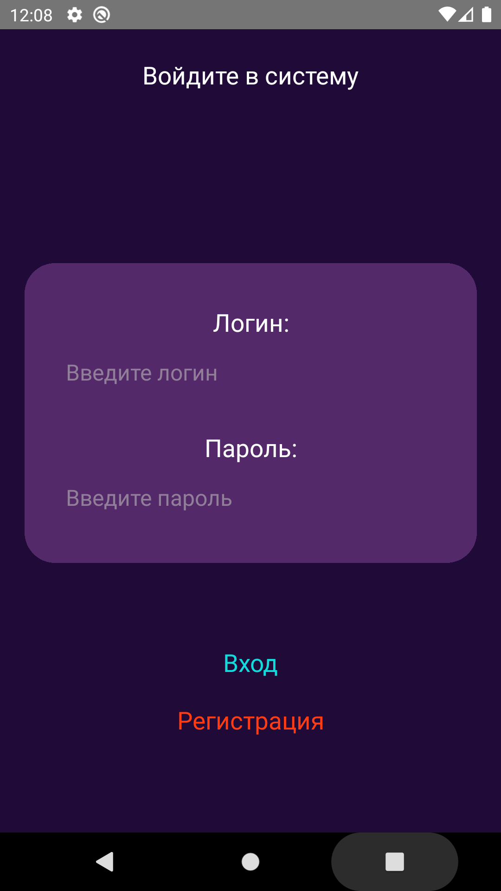
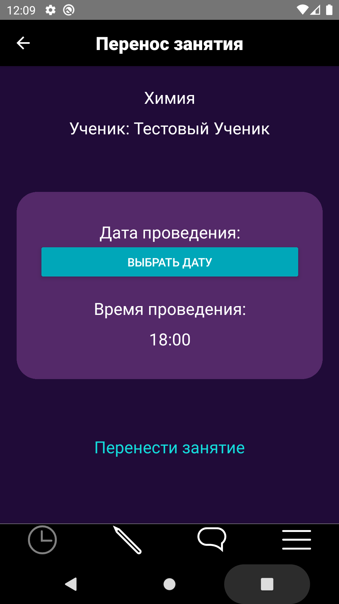

# **Kislota** is a mobile application for automating work with the server of an online educational platform

## Development technologies

- JavaScript
- React Native
- MySql
- Node.js

## Building

```bash
git clone https://github.com/unhuman95/kislota

# using npm
npm install
npm start

# OR using Yarn
yarn install
yarn start
```
### For Android

```bash
# using npm
npm run android

# OR using Yarn
yarn android
```

### For iOS

```bash
# using npm
npm run ios

# OR using Yarn
yarn ios
```

## Screenshots

### login screen


### edit screen

